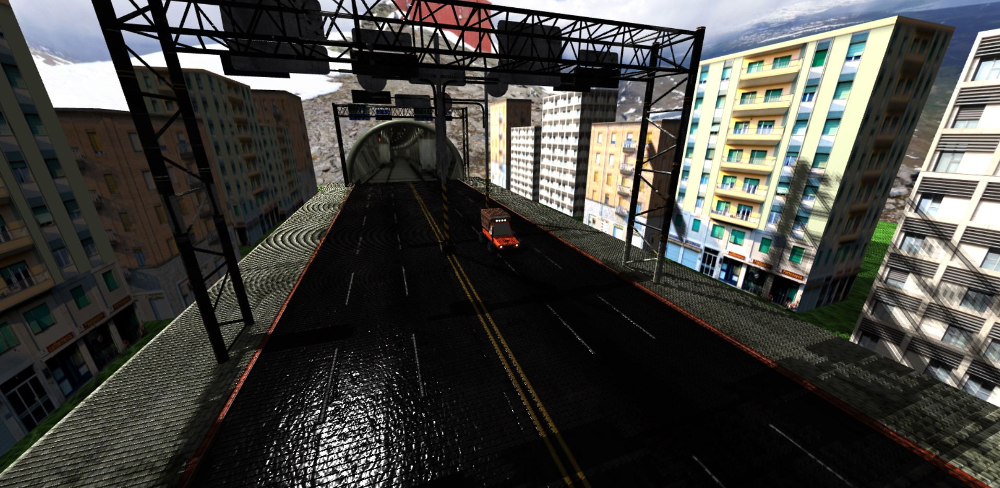
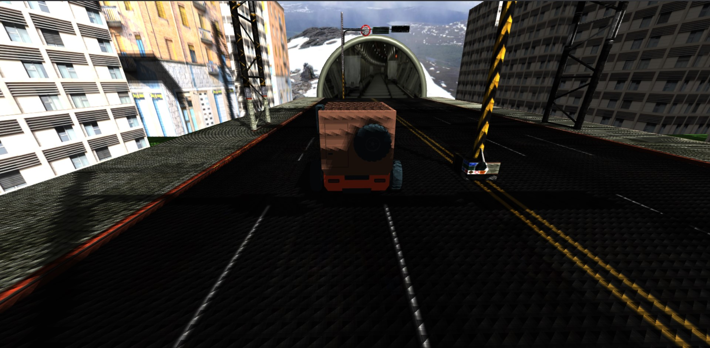
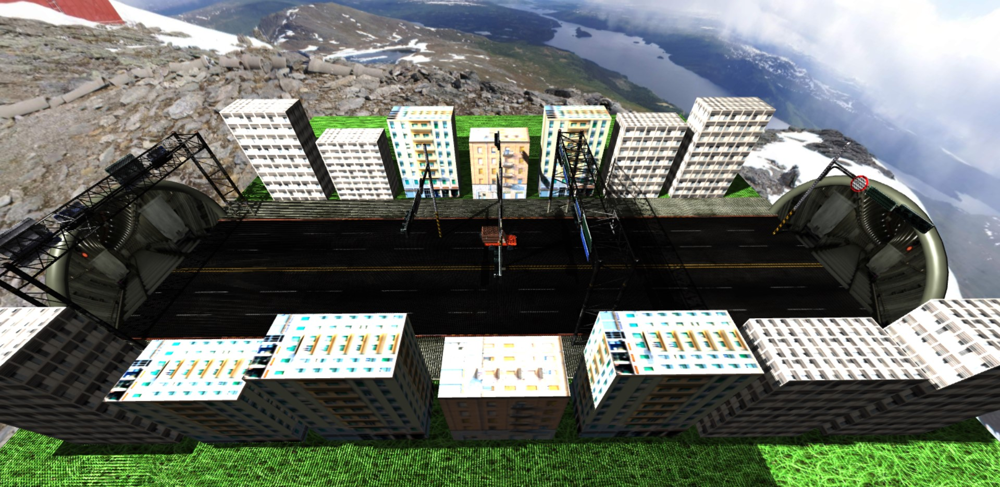

**You need to include threejs library to the script folder and run it using live server for this project to run.**
  
#### Screenshots
  

  

  

#### Environment:
-> Car in a town  
  
#### Geometries
-> Torus for tunnel outer  
-> Circle for tunnel  
-> Cube for building  
-> Plane for floor  
-> Sphere for sun  
  
#### Materials
-> MeshBasicMaterial -> sun, tunnel, skybox  
-> MeshPhongMaterial -> tunnel outer (torus)  
-> MeshLambertMaterial -> building, floor  
  
#### Lights
-> Ambient Light  
-> Point Light  
  
#### Shadow
ok  
  
#### Camera
-> 2 Perspective camera (switchable)  
  
#### Raycast
-> when the tunnel is clicked, the tunnel image will change  
  
#### 3D Models
-> truck  
-> road  
  
#### Skybox
ok    
  
#### Additional Functionality
-> W A S D to Move  
-> C to change camera  